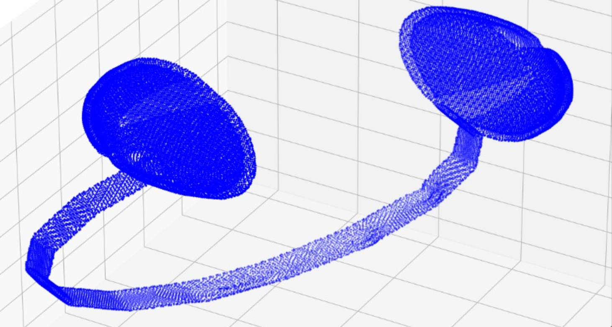
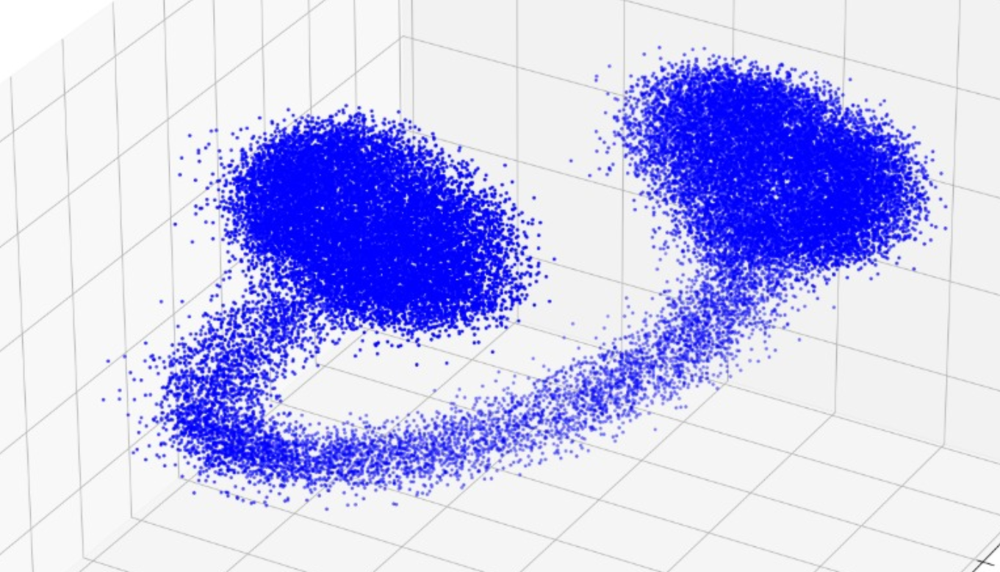
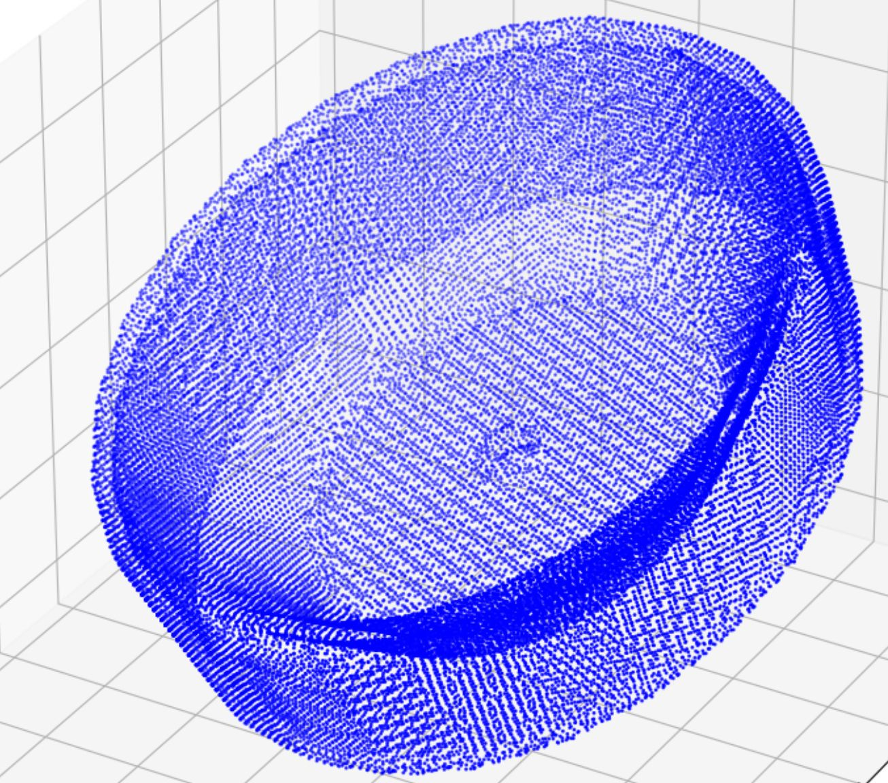
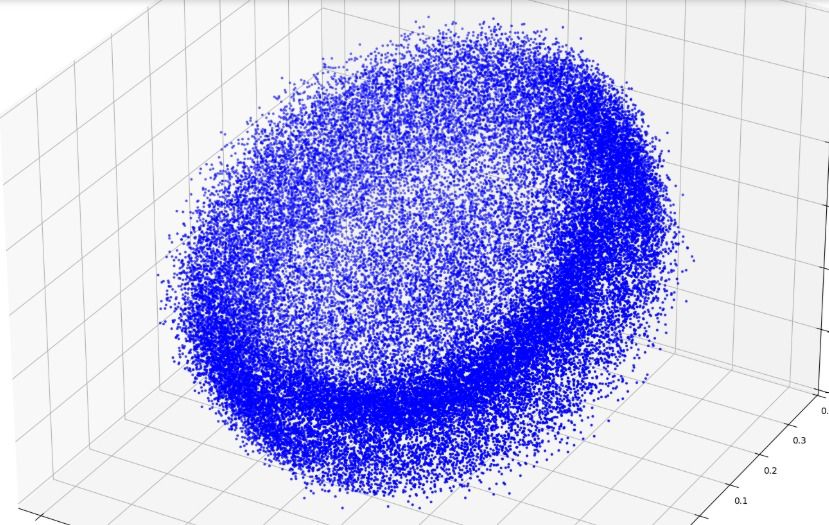

# Consistency Models for 3D Point Cloud Anomaly Detection

This repository contains the implementation of a **novel approach using Consistency Models (CMs)** for the task of **3D point cloud anomaly detection**. While 3D anomaly detection remains an underexplored area—especially for unstructured data like point clouds—this work builds upon and enhances prior methodologies such as **R3D-AD**, offering **faster inference and real-time applicability**.

---

## Motivation

3D anomaly detection plays a crucial role in domains like autonomous navigation, robotics, and industrial inspection. Traditional approaches struggle with the irregular and sparse nature of point clouds. A recent advancement, **R3D-AD**, leverages **Denoising Diffusion Probabilistic Models (DDPMs)** to reconstruct an anomaly-free version of an input point cloud. Comparing the reconstructed and original point clouds allows anomalies on the object’s surface to be detected.

However, DDPMs are **computationally expensive**, requiring **hundreds or thousands of sampling steps**. In contrast, **Consistency Models** offer **one-step generation**, making them ideal for real-time deployment.

---

## 🧠 Core Idea

Instead of a DDPM, our framework employs a **Consistency Model (CM)**, introduced by [Yang Song et al., 2023](https://arxiv.org/abs/2303.01469). These models are trained to produce consistent reconstructions across all diffusion timesteps, i.e., the output at timestep `t` should match the output at `t-1`. Recursively, the output at `t=0` becomes the ground truth.

We adopt **Consistency Training (CT)** over Consistency Distillation (CD), training the model from scratch using a **target model** and an **online model** in a setup inspired by reinforcement learning. The training objective is:

    

Where:
- `f_θ`: online model  
- `f_θ⁻`: target model (EMA of `F_θ`)  
- `d`: a distance metric (e.g., Chamfer Distance or EMD)  
- `λ`: a weighting coefficient

---

## 🔧 Architecture Overview

- **Input**: 3D point cloud with surface anomalies synthesized using Patch-Gen
- **Encoder**: PointNet/PointNet++ backbone to encode into latent space  
- **CM**: Consistency Model trained using self-supervised consistency training  
- **Output**: Reconstructed (anomaly-free) point cloud  
- **Detection**: Chamfer/EMD-based anomaly scoring via input–output deviation

---

## Results

<table>
  <tr>
    <td align="center">
      
       
      <em>(a) Input Point Cloud</em>
    </td>
    <td align="center">
      
       
      <em>(b) Reconstructed Output</em>
    </td>
  </tr>
  <tr>
    <td align="center">
      
       
      <em>(a) Input Point Cloud</em>
    </td>
    <td align="center">
      
       
      <em>(b) Reconstructed Output</em>
    </td>
  </tr>
</table>

The images above were generated after training the consistency model for 800,000 iterations. Notably, the reconstructions are achieved in just two steps, in contrast to traditional diffusion models which typically require hundreds or even thousands of steps. This dramatic reduction in inference steps significantly improves speed, making the method far more suitable for real-time applications.

While there is a trade-off in reconstruction quality, our experiments suggest that further hyperparameter tuning could narrow this gap, potentially bringing the consistency model's performance closer to that of full diffusion models.

Furthermore, these results were obtained using consistency training alone. Incorporating consistency distillation from a pretrained diffusion model is a promising next step that could yield substantially improved reconstructions.

---

## Citations
@article{song2023consistency, 
  title={Consistency Models}, 
  author={Song, Yang and Meng, Chenlin and Ermon, Stefano}, 
  journal={arXiv preprint arXiv:2303.01469}, 
  year={2023} 
}

@inproceedings{cao2023r3dad,
  title={R3D-AD: Reconstructing 3D Shapes for Unsupervised Anomaly Detection in Point Clouds}, 
  author={Cao, Xiyang and Zhang, Ziyang and Liu, Lanqing and Yan, Xiaokang and Yang, Kailun and Zhao  Hengshuang and Geiger, Andreas and Shi, Jianping}, 
  booktitle={Proceedings of the IEEE/CVF Conference on Computer Vision and Pattern Recognition (CVPR)}, 
  year={2023} 
}
